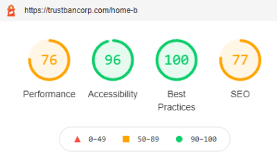
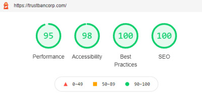
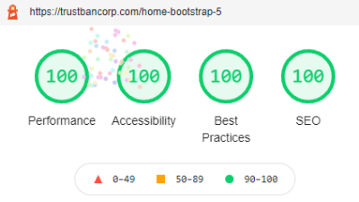

# Achieve the Best Lighthouse Score With Sitefinity 14

As seen on [Progress Accelerated '21](https://www.progress.com/accelerated/agenda?agendaPath=session/632669)

Learn by example how to improve your performance, accessibility, best practices, and SEO scores in Sitefinity. This session will show you how to read Google Lighthouse and Core Web Vitals reports. The discussion includes how scoring has changed over time and how metrics are weighted from version to version. We will cover all four scores and show you examples of how to get perfect 100s with Sitefinity.

### Lighthouse Score Examples

#### Default Bootstrap 4 Resource Package
https://trustbancorp.com/home-b

Uses original size PNG image files with older image templates, incomplete metadata, and uses jQuery. 

#### Tuned Bootstrap 4 Resource Package
https://trustbancorp.com/

Uses WebP image files with new Sitefinity 14 image templates and thumbnails, complete metadata, but still uses jQuery. 

#### Custom Bootstrap 5 Resource Package
https://trustbancorp.com/home-bootstrap-5

Uses WebP image files with new Sitefinity 14 image templates and thumbnails, complete metadata, but uses Bootstrap 5 without jQuery. 

### Sitefinity 14 Proving Ground

This project has several purposes.  The most important purpose is to test and demonstrate web performance.

The second purpose is to demonstrate best practices, code examples, and feature demos.

### Code Quality

The custom code and Bootstrap 5 resource package are being analyzed by SonarCloud automated static code analysis.

